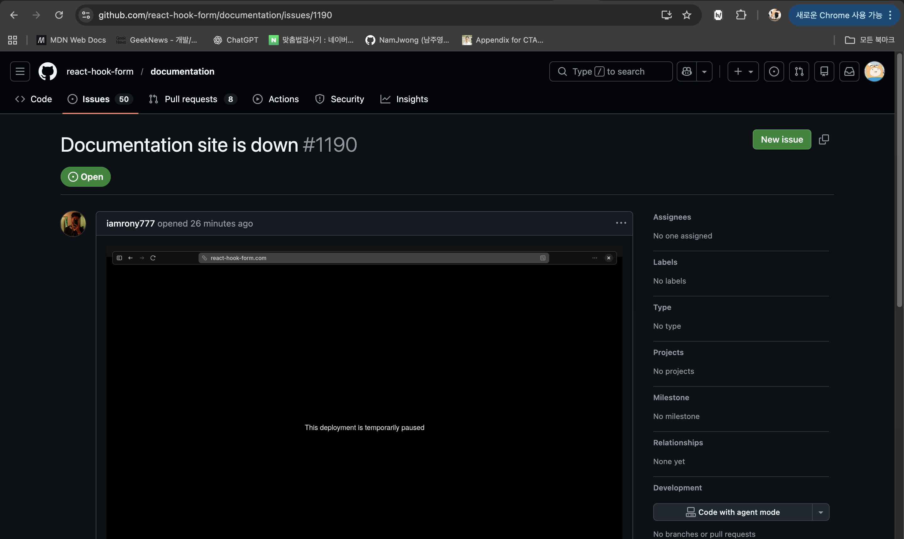

# 260204 (수)

## 오늘의 TIL 요약

- **아티클 읽기**: 타입 시스템이 증명처럼 동작하는 아티클을 읽고 폴더에 기록
- **링크드인 글 (Openclaw)**: Openclaw가 무거워서 직접 만든 경우를 봤고, AI 개인 비서로서 TIL 관리 에이전트를 잘 만들어보고 개인 생활에도 적용해볼 생각
- **링크드인 글 (설계)**: 개발자들이 설계를 어려워하는 이유에 대한 내용을 아티클-읽기 폴더에 작성
- **react-hook-form 폼 필드 빈 상태 타입**: null과 빈 문자열 사이를 고민한 끝에, 폼이라는 역할에 집중하여 빈 문자열로 결정
- **SelectField 컴포넌트**: Radix UI의 SelectValue가 Context를 통해 부모 Select의 상태를 자동으로 읽는 구조임을 파악, 이 과정에서의 의문점 기록
- **생각**: todo 추적 문제, 병렬 학습 가능 여부, 클로드랑 학습 시 react-hook-form 문서 이슈 발견, TIL 압축 의미 퇴색, TIL 에이전트 우선순위 높이기

=> 시험삼아 클로드로 요약해봤는데 별로다..
제안해주는 여러 버전으로 해봤는데 이게 최선이었다.

역시 요약/추출을 위한 상세한 요구 사항이 필요하다

## 아티클 <타입 시스템은 왜 증명처럼 동작하는가> 읽기

아티클-읽기/ 폴더에 기록

## 링크드인 글 - Openclaw가 무거워서 직접 만들었다

https://www.linkedin.com/posts/sihyun-adventure_openclaw-%EB%84%88%EB%AC%B4-%EB%AC%B4%EA%B1%B0%EC%9B%8C%EC%84%9C-%EA%B0%80%EB%B2%BC%EC%9A%B4-%ED%94%84%EB%A1%9C%EA%B7%B8%EB%9E%A8%EC%9D%84-%EC%A7%81%EC%A0%91-%EB%A7%8C%EB%93%A4%EC%97%88%EC%96%B4%EC%9A%94-1-activity-7424433092813316097-CqD4?utm_source=share&utm_medium=member_desktop&rcm=ACoAAD8x7DIBUf0j2wL1cFNJd-JZaIc13o0zeDE

어떻게 하셨지..? 궁금하다 공유할 수 있는 수준이 되면 해준다고 하시니까 팔로우 해두어야겠다.

나도 AI 개인 비서 필요하다. 계획 중인 TIL 관리 에이전트 잘 만들어보고, 다음 액션은 개인 생활에 적용해볼까

## 링크드인 글 - 개발자들이 설계를 어려워 하는 이유

아티클-읽기/개발자들이-설계를-어려워-하는-이유.md 에 작성

## react-hook-form과 폼 필드의 빈 상태 타입

어제 폼 필드의 빈 상태를 나타내는 타입은 기본적으로 null이 베스트라는 결론을 도출했다.

그런데 주요 이유가 미입력 상태를 타입으로 분간할 수 있다는 이유였는데, 이거는 react-hook-form을 사용하면 touchedFields를 사용하면 되기 때문에 필수적이지 않다.

하지만 만약 폼 라이브러리를 바꾸거나 제거하게 된다면?
폼 타입을 라이브러리 기능에 의존해서 설계해도 될까?

그런데 그전에, '미입력' 상태가 이 제품에서 필요한 것인지가 근본적인 고민 같다.

현재 구현 중인 '회의실 예약 폼'은 사용자가 일회성으로 짧은 시간 체류하며 사용될 것으로 예상된다.
사용자의 '미입력' 상태를 검증해야 하는 일이 있을까 싶다.

그러면 가장 간단하게 빈 문자열로 관리하는 건 어떨까.

### 빈 문자열로 해보기

floor: '1' | '2' | '3' | '';

select는 타입이 이런 식으로 되는데 이상하지 않나...

floor: '1' | '2' | '3' | null;

이게 명시적이지 않나?

명시적이긴 한데, '폼' 타입이기 때문에 어색하다.
폼에서 null이 입력되는 일이 없기 때문이다.

select 타입 선언이 어색해보이는 것도 여전한데, '폼'이라는 역할에 집중하는 것이 더 중요한 가치인 것 같아 빈 문자열로 구현해봐야겠다.

## SelectField 컴포넌트 이해하기

```tsx
import { ComponentPropsWithoutRef } from 'react';

import { Label } from './ui/label';
import { Select, SelectContent, SelectItem, SelectTrigger, SelectValue } from './ui/select';

interface SelectFieldProps extends ComponentPropsWithoutRef<typeof Select> {
  label: string;
  placeholder?: string;
  options: { label: string; value: string }[];
}

const SelectField = ({ label, options, placeholder = '선택', ...props }: SelectFieldProps) => {
  return (
    <div className="space-y-2">
      <Label htmlFor="start-time">{label}</Label>
      <Select {...props}>
        <SelectTrigger>
          <SelectValue placeholder={placeholder} />
        </SelectTrigger>
        <SelectContent>
          {options.map((option) => (
            <SelectItem key={option.value} value={option.value}>
              {option.label}
            </SelectItem>
          ))}
        </SelectContent>
      </Select>
    </div>
  );
};

export { SelectField };
```

SelectValue의 역할을 이해하기 어렵다. radix-ui 문서에도 Select.Value라는 컴포넌트는 없다. (SelectPrimitive.Value던데 이건 뭐길래 [문서](https://www.radix-ui.com/themes/docs/components/select)랑 구성이 다른 거지?)

### 클로드의 설명

SelectValue는 Radix UI의 컨텍스트(Context) 기반 컴포넌트입니다. 직접 값을 받는 게 아니라, 부모인 Select(즉, SelectPrimitive.Root)가 내부적으로 관리하는 상태를
자동으로 읽어옵니다.

---

데이터 흐름 정리:

```
Select (value / onValueChange 관리) ← 실제 상태 주인
└─ SelectTrigger
└─ SelectValue ← 상태를 Context에서 읽어 표시
└─ SelectContent
└─ SelectItem (각 옵션) ← 클릭하면 Select의 value를 업데이트
```

1. 선택 전 — value가 없으므로 SelectValue는 placeholder prop ("선택")을 표시합니다.
2. 선택 후 — 사용자가 SelectItem을 클릭하면 Select의 내부 상태(value)가 업데이트되고, SelectValue가 Context를 통해 자동으로 해당 항목의 텍스트를 렌더링합니다.

### 설명 보고 든 생각

컨텍스트로 전달된다는 게 암묵적인 것 같기도 하고, 컴포넌트 구성을 봤을 때는 암묵적이지 않은 것 같기도 하고..

## 생각

### 쌓이는데 추적이 안되는 todo들

이렇게 학습 기록을 매일 남기다보니 '~해야겠다'라든지, 뿌리까지 해결되지 않은 고민이나 궁금증이 계속 쌓여 가는 게 느껴져서 답답하다.

TIL 에이전트가 이런 것들을 제때 '할 일'로 끌어올려주길 기대하고 있는데 그걸 만드는 게 미뤄지고 있는 상황이다.

내일은 학습 시작 전에 일주일치 TIL을 돌아보고 이같은 이슈 3가지를 뽑아 해결해보자.

### 병렬 학습도 가능한가

요즘 직장 다니시는 분들은 AI를 통해 병렬 업무를 하신다고 한다.

터미널 응답 기다리는 시간을 아끼려는 거고, 긴 작업 루틴을 돌려두는 거겠지?

나도 요즘 학습에 AI를 적극적으로 활용하다보니 터미널 응답을 기다리는 시간이 많아지고, 그때마다 집중이 잘 깨져서 병렬로 무언가를 해야 하나 싶다.

메인 학습은 아무래도 과정이 중요하니 내가 계속 지켜봐야 할 것 같고, AI에게 맡겨두고 결과물을 점검하면 될만한 일이 생기면 할 수 있을 것 같다.

흠.. 그런 일이 뭐가 있을까. 사이드프로젝트 MVP?

그리고 그 일을 긴 시간 신경 쓰지 않고 완수 해낼 수 있게 하는 사이클을 만들기도 어려울 것 같다.

두고두고 고민해보자. 할 수만 있다면 시간 효율을 엄청 높여줄테니까

\+ 자꾸만 시간이 뜬다. 확실히 해결하고 싶다.

### 클로드랑 학습하기

```
  잠깐, 내가 스스로 혼란을 만들었다. 다시 정리하자.

  ---
  처음 말이 맞았다
```

A라고 했다가 B라고 했다가 다시 A라고 했다가..

확실한 근거가 되는 소스에 직접 접근하자.

근데 그게 react-hook-form 문서인데 아직도 죽어있다.
너무 불편해서 깃허브 이슈에 올라오진 않았는지 아까부터 들락날락 했는데 없었다가, 드디어 올라왔다.



그냥 이렇게 간단하게 제보해도 되는구나..?

### 압축하는 TIL 의미 퇴색

TIL을 다시 시작할 때, 지식을 체화하기 위한 방법 중 하나로 잘 '압축' 해보자는 게 있었는데 전혀 못하고 있다.
계속 의식의 흐름대로 나열 중이다.

TIL 에이전트 만들 계획을 한 뒤부터 걔가 정리해줄거야.. 모드에 있다.

뭐가 맞는지 잘 모르겠는데 일단 오늘은 학습을 끝낼 때 '오늘의 요약'을 작성해보자

### TIL 에이전트 만들기의 우선순위

오늘 TIL 내용만 해도 이게 계속 언급되고 있다.

우선순위를 높이자

이런 AI 환경 구성하는 것에 대한 정보가 너무 방대해서 뭐부터 해야 할지 감을 못 잡고 있었는데 오늘 마침 FE아티클 스터디에서 발표해주신 [자료](https://github.com/frontend-article-study/frontend-article-study-2/blob/main/sehee/%EC%8A%A4%ED%8E%99%20%EC%A3%BC%EB%8F%84%20%EA%B0%9C%EB%B0%9C.md)가 좋아서, 가이드 삼아 해봐도 좋겠다.
