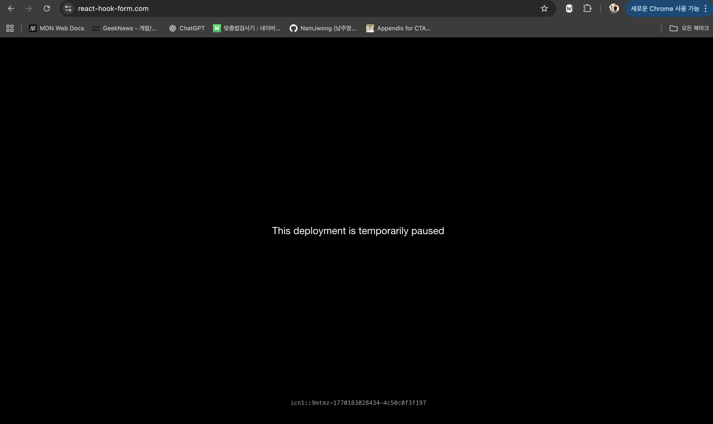

# react-hook-form: isDirty가 초기 렌더 후 true가 되는 경우

## 상황

`useForm`의 `isDirty`를 관찰하기 위해 다음 코드를 추가했는데, 사용자 입력 없이 리렌더 직후 `false` → `true`로 뒤집었다.

```tsx
useEffect(() => {
  console.log(isDirty, touchedFields);
}, [isDirty, touchedFields]);

// 출력
// false {}        ← 초기 렌더
// true  {}        ← 리렌더 후, 입력 없이
```

## 잘못된 가설: Date 객체의 참조 비교

처음에는 컴포넌트 본문에서 `const today = new Date()`가 매 렌더마다 새 객체를 생성하고, react-hook-form이 이 객체를 참조 비교하여 dirty를 판단한다고 생각했다.

이 가설은 두 가지 이유로 틀렸다.

### 1. defaultValues는 초기화 시에만 캡처된다

[createFormControl.ts](https://github.com/react-hook-form/react-hook-form/blob/master/src/logic/createFormControl.ts)에서 확인:

```typescript
let _defaultValues =
  isObject(_options.defaultValues) || isObject(_options.values)
    ? cloneObject(_options.defaultValues || _options.values) || {}
    : {};
```

`_defaultValues`는 `let` closure 변수로, `cloneObject`로 깊은 복사된 후 고정된다.
`today`가 매 렌더마다 새로 생성되어도 이미 캡처된 값에는 영향을 주지 않는다.

\+ 클로드가 제시한 근거가 너무 내부 구현 측면인 내용인 것 같아 라이브러리 코드를 찾아본 건데, 이것은 [공식 문서](https://react-hook-form.com/docs/useform#defaultValues)에서도 명시되어 있다:

> defaultValues are cached. To reset them, use the reset API.

### 2. Date 객체는 타임스탬프로 제대로 비교된다

[deepEqual.ts](https://github.com/react-hook-form/react-hook-form/blob/master/src/utils/deepEqual.ts)에서 확인:

```typescript
if (isDateObject(object1) && isDateObject(object2)) {
  return Object.is(object1.getTime(), object2.getTime());
}
```

참조가 다르더라도 같은 시각이면 동등하다고 판단한다.

## 실제 원인: defaultValues에서 equipment가 빠져 있었음

`useForm` 설정:

```tsx
useForm<BookingForm>({
  defaultValues: {
    date: today,
    attendees: 1,
    startTime: null,
    endTime: null,
    floor: null,
    // equipment가 없음 ← 원인
  },
});
```

`_getDirty`는 현재값 전체와 `_defaultValues` 전체를 `deepEqual`로 비교한다.

```typescript
// createFormControl.ts
const _getDirty: GetIsDirty = (name, data) =>
  !_options.disabled && (name && data && set(_formValues, name, data), !deepEqual(getValues(), _defaultValues));
```

`deepEqual` 안에서 키 개수를 먼저 비교하는데:

```typescript
// deepEqual.ts
const keys1 = Object.keys(object1);
const keys2 = Object.keys(object2);

if (keys1.length !== keys2.length) {
  return false; // ← 여기서 바로 false 반환
}
```

`Controller`가 마운트되면서 `equipment` 필드가 `_formValues`에 등록되는 순간,
`getValues()`의 키 개수가 `_defaultValues`의 키 개수와 달라져서 `deepEqual`이 `false`를 반환하고, `isDirty`가 `true`가 된다.

\+ 이또한 공식 문서에 아래와 같이 적혀있음.

> 긁어오려고 했는데 react-hook-form 사이트 죽음 

## 해결

`defaultValues`에 `equipment: []`를 추가하면 해결된다.

```tsx
defaultValues: {
  date: today,
  attendees: 1,
  startTime: null,
  endTime: null,
  floor: null,
  equipment: [], // ← 추가
},
```

## TODO

- useForm 위주로 react-hook-form 코드 다시 분석해보기. 이 글의 코드 분석 클로드 지분 90%이어서 사실 신뢰도도 조금 떨어지고(버그의 핵심 원인 부분은 신뢰됨.) 스스로 분석하는 경험을 쌓고 싶음.
